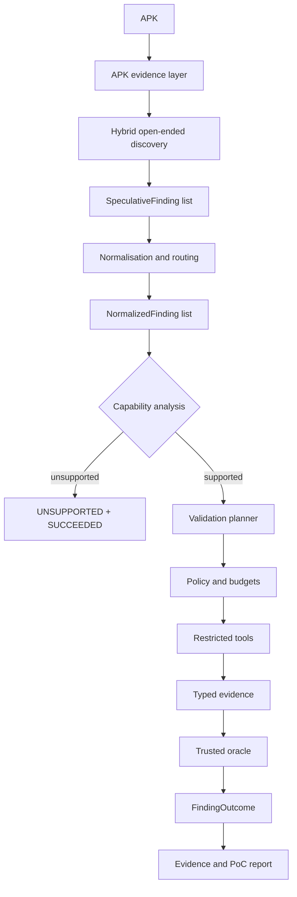

# Stage M final architecture and threat model

## Scope and threat model

The system analyses Android application-layer vulnerabilities on a stock,
non-rooted Android device or emulator. The attacker may possess and reverse
engineer the APK, run another non-privileged application on the same device,
interact with exported application interfaces and the UI, send crafted Intents
or other externally controlled inputs, control untrusted application inputs and
relevant web/network content, and observe behaviour available under Android's
normal security model.

The attacker does not control the Android kernel, have root access, use a custom
ROM, compromise the Android platform, require physical-device attacks, or rely
on hardware side channels. Functional defects are out of scope unless they
violate a security property.

## Architecture

Discovery and normalisation are separate stages. Static checks contribute
evidence and signals to discovery; they do not define the universe of possible
findings. The discovery output is `SpeculativeFinding`, which intentionally has
no category field. Only the downstream `NormalizedFinding` applies the coarse
`CRYPTO`, `ICC`, `NETWORKING`, `NON_API`, `PERMISSION`, `STORAGE`, `SYSTEM`,
`WEB`, `OTHER`, or `UNKNOWN` taxonomy and records validation requirements.
`vulnerability_type` remains a more specific free-form routing label.

This ordering prevents the benchmark taxonomy from becoming a checklist in a
discovery prompt. Categories may be consumed by routing, capability analysis,
evaluation, reporting, and future validation planners, but must not be exposed
to the discovery model as the set of vulnerabilities to search for.

## Discovery autonomy boundary

The future discovery model may decide which code and resources are security
relevant, follow evidence through the application, generate multiple security
hypotheses, identify vulnerabilities absent from the benchmark, propose
observable validation hypotheses, and decide when it has enough discovery
evidence.

It may not execute arbitrary host shell or ADB commands, install arbitrary
software, change policy or budgets, access benchmark labels or expected finding
names, assert an authoritative vulnerability conclusion without validation,
bypass trusted oracle logic, or invent capabilities the host has not exposed.
Validation remains bounded by a host-controlled policy, fixed budgets, typed
evidence, and restricted tools.

## Contracts and state semantics

`SpeculativeFinding` describes an open-ended security hypothesis, its affected
surface and security property where known, portable evidence references, an
observable validation hypothesis, confidence, and limitations. Fields that are
not meaningful for every vulnerability are optional rather than populated with
placeholder values.

`NormalizedFinding` wraps the speculative object and adds its downstream
category, a specific vulnerability type, typed evidence and capability
requirements, and `SUPPORTED` or `UNSUPPORTED` validation support. Support is a
property of the present validation environment, not a claim that the suspected
vulnerability is absent.

`FindingOutcome` keeps the security conclusion separate from workflow health:

| Situation | Finding status | Execution status | Typical reason |
|---|---|---|---|
| Candidate awaits validation | `SPECULATIVE` | `SUCCEEDED` | none |
| Trusted oracle confirms the claim | `VALIDATED` | `SUCCEEDED` | none |
| Validation completes with negative evidence | `NOT_VALIDATED` | `SUCCEEDED` | `NOT_EXPLOITABLE` |
| Required capability is absent | `UNSUPPORTED` | `SUCCEEDED` | `CAPABILITY_UNAVAILABLE` or `UNSUPPORTED_VALIDATION` |
| A tool times out before a conclusion | `INCONCLUSIVE` | `FAILED` | `TOOL_TIMEOUT` |
| Oracle evidence is insufficient | `INCONCLUSIVE` | `SUCCEEDED` or `FAILED` as applicable | `ORACLE_INSUFFICIENT_EVIDENCE` |

A failed execution cannot produce `VALIDATED`, `NOT_VALIDATED`, or
`UNSUPPORTED`. In particular, infrastructure failure is not negative security
evidence.

The typed `FailureReason` taxonomy covers discovery misses, malformed
candidates, normalization failures, unavailable or unsupported capabilities,
policy rejection, planner/tool budget exhaustion, planner failure, tool timeout
and execution failure, environment failure, oracle insufficiency/failure, and a
completed negative (`NOT_EXPLOITABLE`). `ProcessingStage` locates the failure at
discovery, normalization, capability analysis, planning, policy, execution, or
oracle evaluation. These values remain distinct in serialized outcomes.

## Capability-vulnerability matrix

`architecture.capability_matrix.CAPABILITY_VULNERABILITY_MATRIX` is the
machine-readable source for representative future routing requirements. It is
an implementation/evaluation aid, not a discovery prompt and not a claim that
all listed capabilities exist today.

| Category | Representative class | Evidence | Capabilities | Oracle |
|---|---|---|---|---|
| `CRYPTO` | Hard-coded key / forgery | Code, resources, computation | Code/resource inspection, computation | Extracted key enables the expected security-relevant operation |
| `ICC` | Exported component | Manifest, runtime behaviour | Component/device control, runtime observation | Attacker reaches the protected/exposed component |
| `NETWORKING` | Unencrypted socket communication | Code, network traffic | Code and runtime/network observation | Synthetic secret is observable in plaintext |
| `NON_API` | Unintended manifest merge | Packaged manifest, code/resources | Static code/resource inspection | Unintended configuration exists in the packaged app |
| `PERMISSION` | Weak custom permission | Manifest, runtime behaviour | Manifest inspection, ICC/runtime interaction | Sensitive action is accessible under the weak permission model |
| `STORAGE` | SQLite injection | Code, attacker input, data/runtime behaviour | Code, UI/input, runtime observation | Crafted input changes query semantics or security-relevant behaviour |
| `SYSTEM` | Clipboard exposure | Code, runtime clipboard state | UI/device/runtime observation | Synthetic secret appears in clipboard state |
| `WEB` | WebView JavaScript/code injection | Code, controlled web content, runtime effect | Code, UI/web interaction, runtime observation | Payload produces a deterministic marker/effect |

`OTHER` and `UNKNOWN` remain valid normalised categories when no representative
entry maps cleanly. They deliberately do not force a fabricated validation
route.

## Existing exported-component vertical slice

The Stage B `scanner.models.Finding` and its JSON shape remain unchanged.
`adapt_exported_component_finding` projects that object into a generic
`SpeculativeFinding`; `normalize_exported_component_finding` then applies the
downstream `ICC` category and identifies only activities as currently supported.
The existing restricted ADB planner, deterministic O1/O2 oracle, replay data,
validator result schema, and Markdown reporter therefore continue to operate
without rewriting historical artifacts.

`adapt_agent_run_outcome` provides the new state semantics over a legacy agent
run. Completed positive and negative oracle decisions become `VALIDATED` or
`NOT_VALIDATED` with `SUCCEEDED`. A terminal required-tool timeout is upgraded
to `INCONCLUSIVE` with `FAILED`, even though the preserved legacy validation
schema could only express a binary status. Future schemas should serialize the
new two-dimensional outcome directly; Stage M does not migrate old evidence.

The existing validation planner's `EXPORTED_ACTIVITY` context is downstream of
finding selection. It is not the benchmark category taxonomy and is not an
open-ended discovery prompt.

## Stage M implementation boundary

Stage M freezes contracts only. It does not add free-form model discovery,
Jadx, new vulnerability validators, additional emulator/network tools, arbitrary
shell or ADB access, new benchmark APKs, or expanded evaluations. Later stages
should implement normalizers and capability providers against these contracts,
then add oracle-backed validation routes one vertical slice at a time.
